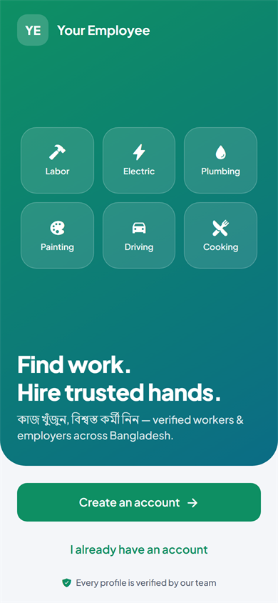
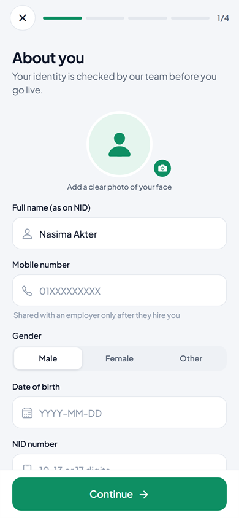
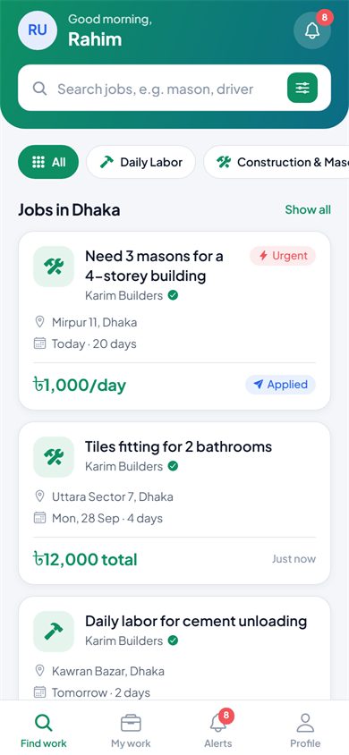
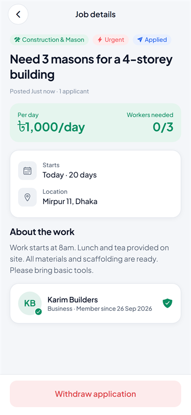
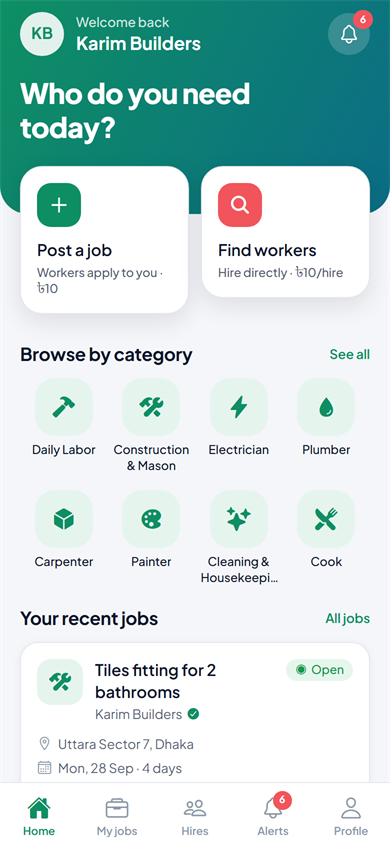
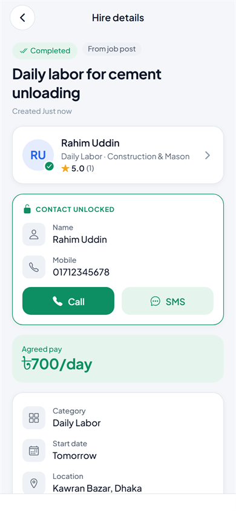
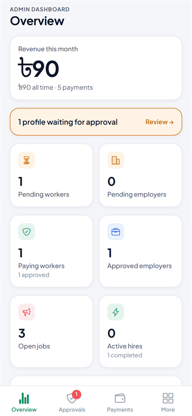
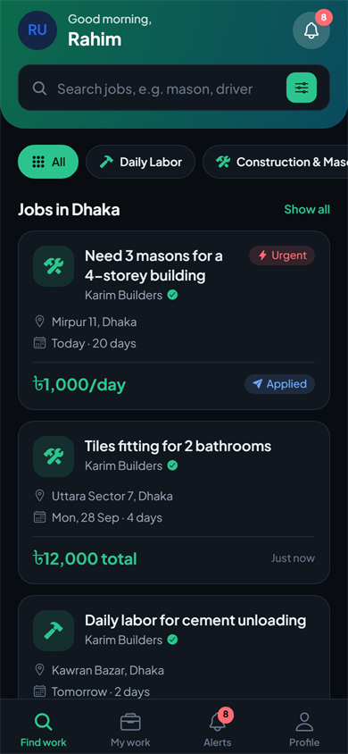
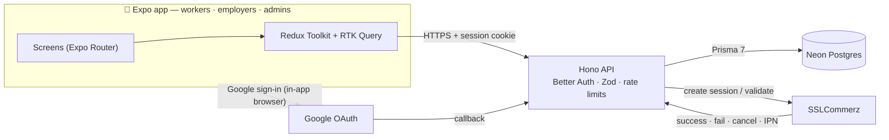
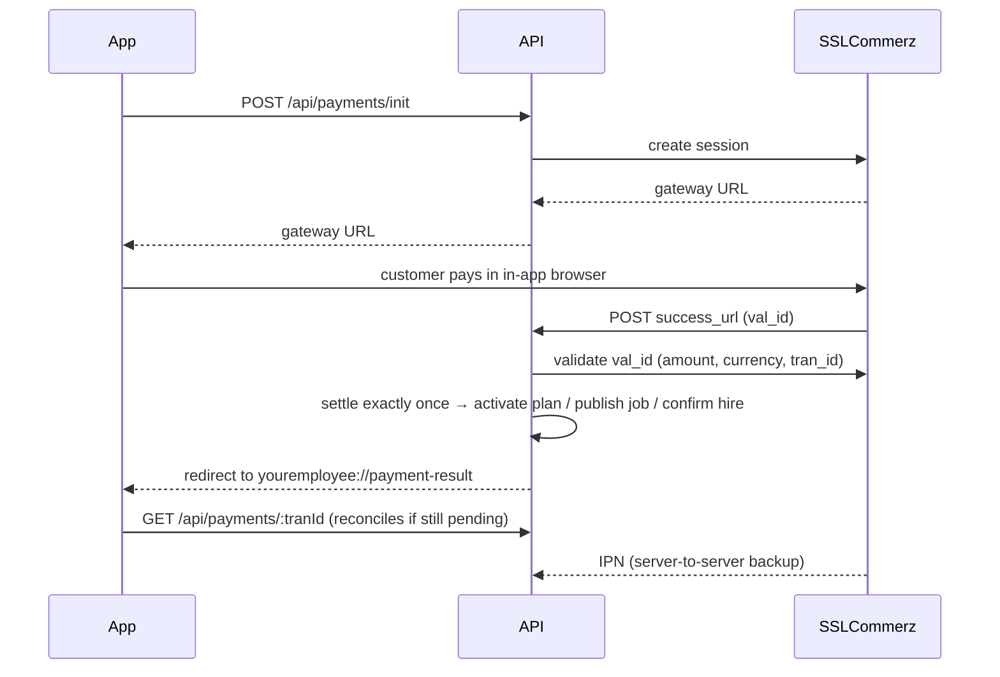

<div align="center">

# Your Employee

**A verified marketplace that connects daily workers with employers across Bangladesh.**
<br/>
কাজ খুঁজুন, বিশ্বস্ত কর্মী নিন


</div>

---

## Table of contents

- [Overview](#overview)
- [Screenshots](#screenshots)
- [How it works](#how-it-works)
- [Features](#features)
- [Tech stack](#tech-stack)
- [Architecture](#architecture)
- [Project structure](#project-structure)
- [Getting started](#getting-started)
- [Environment variables](#environment-variables)
- [Scripts](#scripts)
- [Testing](#testing)
- [API reference](#api-reference)
- [Security](#security)
- [Deployment](#deployment)
- [Troubleshooting](#troubleshooting)
- [Project status & roadmap](#project-status--roadmap)
- [Contributing](#contributing)
- [License](#license)

---

## Overview

Millions of people in Bangladesh find daily work (masons, electricians, porters, cooks, drivers) through word of mouth, with no way to prove who they are or what they've done. **Your Employee** gives them a verified profile and gives employers a safe way to find and hire them.

The app has three roles:

| Role | What they do |
|---|---|
| 👷 **Worker** | Registers with NID and skills, gets verified, applies to jobs and receives direct offers |
| 🏢 **Employer** | Registers as an individual or a business, gets verified, posts jobs or hires workers directly |
| 🛡️ **Admin** | Approves profiles, moderates jobs, manages categories and watches revenue |

Revenue comes from small fees paid through **SSLCommerz** (bKash, Nagad, Rocket, cards):

| Fee | Paid by | Default |
|---|---|---|
| Worker plan (30 days) | Worker | **৳50** |
| Job post | Employer | **৳10** |
| Hire (applicant or direct offer) | Employer | **৳10** |

All prices are set in `server/.env`.

---

## Screenshots

<table>
  <tr>
    <td align="center"><br/><sub>Welcome</sub></td>
    <td align="center"><br/><sub>Worker registration</sub></td>
    <td align="center"><br/><sub>Job feed</sub></td>
    <td align="center"><br/><sub>Job details</sub></td>
  </tr>
  <tr>
    <td align="center"><br/><sub>Employer home</sub></td>
    <td align="center"><br/><sub>Hire & contact unlock</sub></td>
    <td align="center"><br/><sub>Admin dashboard</sub></td>
    <td align="center"><br/><sub>Dark mode</sub></td>
  </tr>
</table>

<sub>Captured from the web build at phone size, using sample data.</sub>

---

## How it works

**Workers**
1. Sign up with email/password or Google, then choose **"I want work"**.
2. Fill in a 4-step profile: photo, name as on NID, mobile, date of birth, NID number and optional NID photo; division → district → area; up to 5 work categories and skills; expected wage and availability.
3. An admin reviews the profile. The app shows the status and moves on by itself once approved.
4. Approved workers can browse jobs for free. The **৳50 plan** lets them apply, appear in employer searches and receive direct offers. Renewing early adds days on top.

**Employers**
1. Sign up, choose **"I want to hire"**, and register as an individual/household or a business (NID or trade licence required). An admin approves the profile.
2. **Post a job**: it goes live after the ৳10 payment, and available workers in the same category and district are notified.
3. Shortlist or reject applicants, then **hire (৳10)**. The hire is confirmed immediately.
4. Or **find workers directly** by category, district, skill or rating and send an **offer (৳10)**. The worker accepts or declines.
5. Mark the work completed and **rate the worker** (1–5★ with a comment).

**Fair-play rules**
- Phone numbers and addresses are revealed to both sides **only after a hire is confirmed**; that's what the hiring fee pays for.
- If a worker **declines** a paid offer, or the employer cancels it before an answer, the employer gets a **free hire credit** instead of a cash refund.
- Suspending an employer closes their open jobs. Editing identity details (name, NID…) on an approved profile sends it back for review.

---

## Features

- **Auth:** email/password and Google sign-in (no verification codes), 30-day sessions stored in the device's SecureStore, account deletion.
- **Onboarding & verification:** role selection, multi-step forms validated with regex (Bangladeshi mobile `01[3-9]XXXXXXXX`, NID 10/13/17 digits), all 8 divisions and 64 districts, NID photo kept private.
- **Marketplace:** job feed with category/district/urgency filters and search, applications, shortlisting, hires, direct offers, hire credits, reviews and ratings.
- **Payments:** SSLCommerz checkout in an in-app browser, a deep link back into the app, and every payment re-validated on the server. Duplicate callbacks are ignored, and payments that never called back are reconciled.
- **Admin dashboard (in the same app):** revenue this month and all time, 7-day revenue chart (Bangladesh days), approval queues with the NID photo, users, payments, job moderation and category management (English + বাংলা names).
- **In-app notifications** with unread badges.
- **UX:** light/dark/auto theme, skeleton loaders, pull-to-refresh, infinite scroll, haptics, spring animations, bottom sheets, empty and error states with retry.
- **Performance:**
  - server-side session cache, so repeat requests skip the database lookup;
  - public list queries select only public columns;
  - details prefetch as soon as a card is touched;
  - polling pauses while the app is in the background;
  - payments refresh only the cached data they change;
  - images are resized on the phone and cached forever.

---

## Tech stack

| Layer | Technology |
|---|---|
| Mobile | [Expo SDK 57](https://docs.expo.dev) (React Native 0.86, React 19.2), Expo Router, React Compiler, TypeScript |
| State | [Redux Toolkit](https://redux-toolkit.js.org) + RTK Query (cache tags, infinite queries, optimistic updates) |
| UI | Custom design system, Plus Jakarta Sans, Ionicons, Reanimated 4, FlashList 2, expo-image |
| API | [Hono 4](https://hono.dev) on Node.js, Zod validation, in-memory rate limiting |
| Auth | [Better Auth 1.7](https://www.better-auth.com) + `@better-auth/expo` |
| Database | [Neon](https://neon.tech) Postgres via [Prisma ORM 7](https://www.prisma.io) (`prisma-client` generator, `@prisma/adapter-pg`) |
| Payments | [SSLCommerz](https://developer.sslcommerz.com) REST API (sandbox + live) |
| Tests | Node test runner + [PGlite](https://pglite.dev) (in-process Postgres), mocked SSLCommerz |

No Docker required anywhere.

---

## Architecture



**Payment flow**: the app never trusts the redirect alone.



---

## Project structure

Both apps are organised **by feature**.

```
.
├── server/                    API
│   ├── prisma/                schema.prisma · migrations/ · seed.ts
│   ├── tests/                 end-to-end + unit tests (npm test)
│   └── src/
│       ├── index.ts           starts the HTTP server
│       ├── app.ts             middleware, rate limits, routes, error handling
│       ├── config/            validated environment & pricing
│       ├── db/                Prisma client, seed functions
│       ├── lib/               auth, session cache, errors, validation, pagination,
│       │                      rate limiter, notifications, SSLCommerz client
│       ├── middleware/        session + role/approval guards
│       ├── shared/            Zod field schemas, serializers, locations, categories
│       └── modules/           account · jobs · applications · hires · workers ·
│                              payments · notifications · admin · media · meta
│                              (each: *.routes.ts → *.schemas.ts → *.service.ts)
├── mobile/                    Expo app
│   └── src/
│       ├── app/               screens only (Expo Router)
│       ├── features/          per feature: api.ts + components + hooks
│       │                      (account, auth, jobs, hires, workers, payments,
│       │                       notifications, admin, meta)
│       ├── components/        ui/ (design system) · lists/ · form/ · layout/
│       ├── store/             Redux store, base API, slices
│       ├── lib/ · hooks/      auth client, formatting, validation, image upload
│       ├── theme/             light/dark tokens, typography, spacing
│       └── types/             API response types
└── docs/screenshots/
```

**Conventions:**
- Server route files only parse input and call a service. Business rules live in `*.service.ts`.
- Mobile screens compose feature components (`JobActionBar`, `HireActionBar`, `usePayment`, `useHireFlow`…).
- Lists use the shared `InfiniteList`, and detail screens use `QueryFallback` for loading and error states.

---

## Getting started

### Prerequisites

- **Node.js 20.19+** (developed on Node 24) and npm
- A **Postgres** database. [Neon](https://neon.tech) is recommended (free tier); any PostgreSQL 14+ works.
- An **SSLCommerz sandbox** store: [register here](https://developer.sslcommerz.com/registration/)
- **Expo Go** on your phone, or an Android emulator / iOS simulator
- *(Optional)* a Google Cloud OAuth client for Google sign-in

### 1. Install

```bash
git clone <your-repo-url> your-employee
cd your-employee

cd server && npm install      # also generates the Prisma client
cd ../mobile && npm install
```

### 2. Configure the API

```bash
cd server
cp .env.example .env
```

Fill in at least these (full list in [Environment variables](#environment-variables)):

```dotenv
DATABASE_URL=postgresql://…-pooler.…neon.tech/neondb?sslmode=require   # pooled
DIRECT_URL=postgresql://….neon.tech/neondb?sslmode=require             # direct
BETTER_AUTH_URL=http://192.168.0.105:4000        # your PC's LAN IP (see step 5)
BETTER_AUTH_SECRET=<32+ random characters>
SSLCOMMERZ_STORE_ID=<sandbox store id>
SSLCOMMERZ_STORE_PASSWORD=<sandbox store password>
ADMIN_EMAIL=you@example.com
ADMIN_PASSWORD=<a strong password>
```

Generate a secret with:

```bash
node -e "console.log(require('crypto').randomBytes(32).toString('hex'))"
```

### 3. Create the database

```bash
npx prisma migrate deploy   # creates all tables
npm run db:seed             # 22 work categories + your admin account
```

### 4. Start the API

```bash
npm run dev                 # http://localhost:4000 (restarts on changes)
curl http://localhost:4000/api/health
```

### 5. Run the app

```bash
cd ../mobile
cp .env.example .env
```

Set `EXPO_PUBLIC_API_URL` to your computer's **LAN IP** (run `ipconfig` on Windows, `ip addr`/`ifconfig` on macOS or Linux). `localhost` won't work from a phone.

```dotenv
EXPO_PUBLIC_API_URL=http://192.168.0.105:4000
```

```bash
npx expo start              # scan the QR code with Expo Go
```

Sign in with `ADMIN_EMAIL` / `ADMIN_PASSWORD` to open the admin dashboard. Create other accounts in the app to try the worker and employer flows. The admin dashboard also works in a browser: `npx expo start --web` (add `http://localhost:8081` to `CORS_ORIGINS`).

### Google sign-in (optional)

1. Google Cloud Console → **APIs & Services → Credentials → Create OAuth client ID → Web application**.
2. Add the authorised redirect URI `<BETTER_AUTH_URL>/api/auth/callback/google`.
3. Put the client ID and secret in `server/.env`. The Google button appears automatically.

> Google does not accept LAN IPs such as `192.168.x.x`. For local testing, expose the API over HTTPS with a tunnel (`npx cloudflared tunnel --url http://localhost:4000` or ngrok). Use that URL for **both** `BETTER_AUTH_URL` and `EXPO_PUBLIC_API_URL`.

### SSLCommerz

- **Sandbox:** keep `SSLCOMMERZ_IS_LIVE=false`. The success/fail/cancel pages are opened by the phone's browser, so a LAN `BETTER_AUTH_URL` works.
- **IPN** (server-to-server confirmation) needs a public URL. The app also confirms payments itself, so IPN is a backup.
- **Live:** set `SSLCOMMERZ_IS_LIVE=true` and register `<your-domain>/api/payments/sslcommerz/ipn` as the IPN URL in the merchant panel.

---

## Environment variables

### `server/.env`

| Variable | Required | Description |
|---|:---:|---|
| `DATABASE_URL` | ✅ | Postgres connection used at runtime (Neon **pooled** URL, host contains `-pooler`) |
| `DIRECT_URL` | ✅* | Direct (unpooled) URL used by Prisma migrations. *Falls back to `DATABASE_URL`* |
| `BETTER_AUTH_URL` | ✅ | Public base URL of the API (used for auth and payment callbacks) |
| `BETTER_AUTH_SECRET` | ✅ | 32+ random characters used to sign sessions |
| `PORT` | | API port (default `4000`) |
| `NODE_ENV` | | `development` / `production` (production disables Expo Go deep links) |
| `APP_SCHEME` | | Deep-link scheme; must match `mobile/app.json` (default `youremployee`) |
| `CORS_ORIGINS` | | Comma-separated browser origins, e.g. the Expo web dev server |
| `TRUST_PROXY` | | `true` behind Render/Railway/Nginx/Cloudflare so real client IPs are used |
| `GOOGLE_CLIENT_ID` / `GOOGLE_CLIENT_SECRET` | | Enables Google sign-in |
| `SSLCOMMERZ_STORE_ID` / `SSLCOMMERZ_STORE_PASSWORD` | | Enables payments (without them, checkout is disabled or reports “Payments are not configured”) |
| `SSLCOMMERZ_IS_LIVE` | | `false` = sandbox, `true` = live |
| `WORKER_MONTHLY_FEE` · `JOB_POST_FEE` · `HIRE_FEE` | | Prices in BDT (defaults `50` · `10` · `10`) |
| `SUBSCRIPTION_DAYS` | | Length of the worker plan (default `30`) |
| `ADMIN_EMAIL` · `ADMIN_PASSWORD` · `ADMIN_NAME` | | First admin, created by `npm run db:seed` |

The server validates these at startup and prints exactly what is missing.

### `mobile/.env`

| Variable | Description |
|---|---|
| `EXPO_PUBLIC_API_URL` | Base URL of the API (LAN IP in development, HTTPS domain in production) |

---

## Scripts

| `server/` | |
|---|---|
| `npm run dev` | Start the API with auto-reload |
| `npm start` | Start the API |
| `npm test` | Run the test suite (no database or network needed) |
| `npm run typecheck` | TypeScript check (source + tests) |
| `npm run db:migrate` | Create a new migration after editing `schema.prisma` (development) |
| `npm run db:deploy` | Apply migrations (production / Neon) |
| `npm run db:seed` | Seed categories and the admin account |
| `npm run db:studio` | Browse the database in Prisma Studio |

| `mobile/` | |
|---|---|
| `npm start` | Start the Expo dev server |
| `npm run android` / `ios` / `web` | Start and open a specific platform |
| `npm run typecheck` | TypeScript check (including typed routes) |
| `npm run lint` | ESLint (Expo config) |

---

## Testing

```bash
cd server
npm test
```

The suite boots the real API against an **in-process Postgres** ([PGlite](https://pglite.dev)) with the real migration applied, and replaces SSLCommerz with an HTTP-level mock. It needs no Docker, no Neon account and no network, and takes about 30 seconds.

It covers:
- sign-up, onboarding validation and admin approval;
- the ৳50 subscription, including early renewal;
- job posting, applying, hiring, contact reveal, completion and reviews;
- direct offers → decline → free credit → re-offer → accept;
- the full SSLCommerz callback path, forged callbacks, duplicate IPNs and reconciliation of payments that never called back;
- admin stats, job moderation, media privacy, session cache eviction and account deletion;
- rate limiting and the regex validators.

Mobile checks:

```bash
cd mobile
npm run typecheck && npm run lint && npx expo-doctor
```

---

## API reference

Base URL: `/api`. Errors always look like `{ "error": { "code", "message", "details" } }`.

| Area | Endpoints |
|---|---|
| Public | `GET /health` · `GET /meta` (categories, districts, pricing, feature flags) · `GET /media/:id` |
| Auth | `/auth/*`: Better Auth (`sign-up/email`, `sign-in/email`, `sign-in/social`, `get-session`, `sign-out`…) |
| Account | `GET /me` · `PUT /me/worker` · `PUT /me/employer` · `PATCH /me/availability` · `DELETE /me` · `POST /media` |
| Jobs | `GET /jobs` · `GET /jobs/mine` · `POST /jobs` · `GET /jobs/:id` · `POST /jobs/:id/close` · `POST /jobs/:id/reopen` · `DELETE /jobs/:id` · `POST /jobs/:id/apply` · `GET /jobs/:id/applications` |
| Applications | `GET /applications/mine` · `POST /applications/:id/{withdraw, shortlist, reject, hire}` |
| Workers | `GET /workers` (category, district, search, rating, sort) · `GET /workers/:id` |
| Hires | `GET /hires` · `POST /hires` (direct offer) · `GET /hires/:id` · `POST /hires/:id/{accept, decline, complete, cancel, review}` |
| Payments | `POST /payments/init` · `GET /payments` · `GET /payments/:tranId` · `/payments/sslcommerz/{success, fail, cancel, ipn}` |
| Notifications | `GET /notifications` · `GET /notifications/unread-count` · `POST /notifications/read` |
| Admin | `GET /admin/stats` · `GET /admin/{workers,employers}` · `GET /admin/{workers,employers}/:id` · `POST /admin/{workers,employers}/:id/decision` · `GET /admin/users` · `GET /admin/payments` · `GET /admin/jobs` · `POST /admin/jobs/:id/remove` · `GET/POST/PATCH /admin/categories` |

Lists use cursor pagination: `?cursor=<id>&limit=20` → `{ items, nextCursor }`.

---

## Security

- **Rate limits:**
  - 300 requests/min per IP on the API and 40/min on auth routes;
  - Better Auth's own limits: sign-in 8/min, sign-up 5 per 10 min;
  - per-user limits on payments, applications, job posts, offers and uploads.
- **Validation:** every endpoint validates input with Zod. A district must belong to its division, and uploads are checked by magic bytes (JPEG/PNG/WebP, ≤ 1.5 MB).
- **Privacy:** phone numbers, NID numbers and addresses are never included in public data. NID photos are visible only to their owner and admins.
- **Payments:** amounts, currency and transaction IDs are verified with SSLCommerz before anything is granted. Redirects only go back into the app, and settlement is idempotent.
- **Headers & limits:** secure headers, a CORS allow-list, and a 256 KB JSON body limit.

---

## Deployment

### API (any Node host, no Docker)

Render, Railway, Fly.io or a VPS with `pm2` all work:

```bash
npm ci
npx prisma migrate deploy
npm start
```

Set `NODE_ENV=production`, `TRUST_PROXY=true` (behind a proxy), `BETTER_AUTH_URL=https://api.yourdomain.com`, and the rest of `.env`.

> The rate limiter and session cache are in memory, which is right for one instance. If you scale out, move them to Redis or Postgres.

### Mobile

```bash
cd mobile
npx eas-cli@latest build:configure
npx eas-cli@latest build -p android     # or -p ios
```

Set `EXPO_PUBLIC_API_URL` to your production API in the `env` block of your `eas.json` build profile. Update the bundle identifiers in `app.json` (`com.youremployee.app`) if needed.

### Go-live checklist

- [ ] `SSLCOMMERZ_IS_LIVE=true` with live store credentials, and the IPN URL registered
- [ ] Google OAuth redirect URI set to the production domain
- [ ] A strong `BETTER_AUTH_SECRET` and admin password
- [ ] Custom app icon and splash artwork in `mobile/assets/images`

---

## Troubleshooting

| Problem | Fix |
|---|---|
| The app shows **"You're offline"** on a phone | `EXPO_PUBLIC_API_URL` must use your PC's LAN IP, both devices must be on the same Wi-Fi, and your firewall must allow port 4000 |
| The server exits with **"Invalid environment variables"** | Fill in the variables it lists in `server/.env` |
| `prisma migrate` can't reach Neon | Use the **direct** (non-pooler) URL in `DIRECT_URL` |
| Google shows **`redirect_uri_mismatch`** | The redirect URI must be exactly `<BETTER_AUTH_URL>/api/auth/callback/google` over HTTPS (use a tunnel locally) |
| Checkout is disabled or says **“Payments are not configured”** | Set `SSLCOMMERZ_STORE_ID` and `SSLCOMMERZ_STORE_PASSWORD`, then restart the API |
| **429 Too many requests** while testing | Rate limits are working as designed; wait a minute or restart the API (limits are in memory) |
| npm asks to approve install scripts (npm 11+) | `npm install-scripts approve <package>` |

---

## Project status & roadmap

**Status:**
- All features above are implemented.
- Verified with TypeScript (including typed routes), ESLint, `expo-doctor`, the automated API tests, and a Playwright UI pass over the web build for every role.
- **Not yet** tested on physical Android/iOS devices or with real SSLCommerz sandbox payments.

**Roadmap:**
- Push notifications (expo-notifications + EAS)
- Password reset by email (Resend/SES via Better Auth's `sendResetPassword`)
- Full Bangla UI (i18n); categories and divisions already have Bangla names
- Subscription expiry reminders
- Workers rating employers, in-app chat, refunds via SSLCommerz
- Shared rate-limit/session store for multi-instance deployments
- Mobile component tests (Jest + React Native Testing Library)

---

## Contributing

1. Keep the structure: a server feature is `modules/<name>/{routes,schemas,service}.ts`, and a mobile feature is `features/<name>/`.
2. Run the checks before opening a PR:
   ```bash
   cd server && npm run typecheck && npm test
   cd ../mobile && npm run typecheck && npm run lint
   ```
3. After changing `server/prisma/schema.prisma`, create a migration with `npm run db:migrate -- --name <change>`.

---

## License

No license has been chosen yet, so all rights are reserved. Add a `LICENSE` file before publishing or accepting outside contributions.
# Your-Employee

